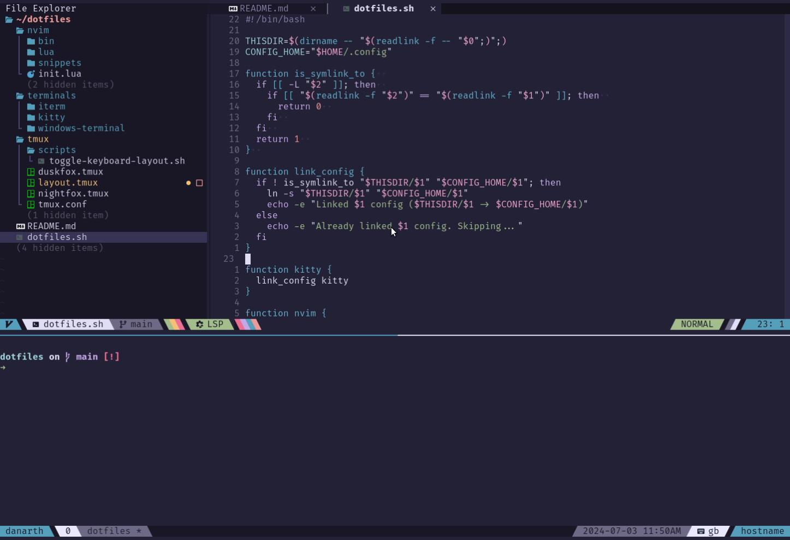

# My dotfiles 
My configuration files for Neovim, Tmux and Zsh



> [!IMPORTANT]  
> This utility doesn't install any programs or dependencies. It only provides and sets up the
> configuration files for my commonly used tools.

## Pre-requisites
I have tested this on Ubuntu, MacOS and WSL (Ubuntu). The following are required:
- ZSH
- A patched NerdFont - I use **FiraCode Nerd Font**. It doesn't support italics though so I use
  **Cascadia Code NF** as an italic font.

## Usage

```sh
./dotfiles.sh --help
```

## Zsh

In your ~/.zshrc, add the following

```zsh
source ~/dotfiles/.zshrc
```

## Themes
Currently supported themese are:
- Nightfox
- Duskfox (shown in screenshot)
