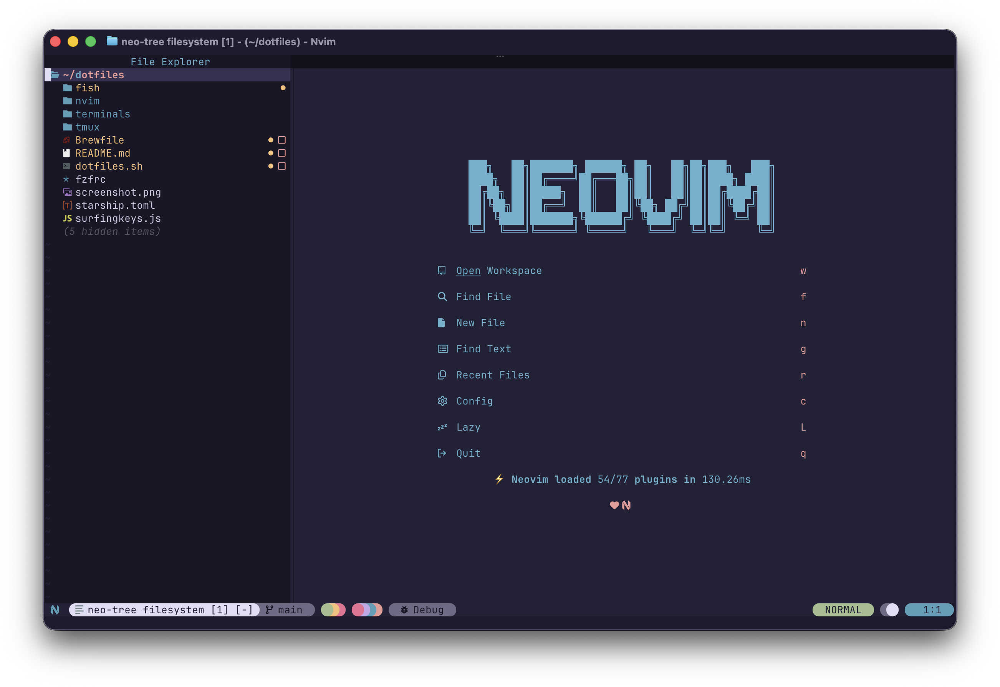

# My dotfiles 

My config files for Neovim, Fish and more!



> [!IMPORTANT]  
> This utility doesn't install any programs or dependencies. It only provides and sets up the
> configuration files for my commonly used tools.

## Pre-requisites
- Ghostty
- Homebrew: in this repo, run `brew bundle`

## Usage

```sh
./dotfiles.sh --help
```

## Local Configs

There will often be config that is specific to a local machine and shouldn't be committed to version
control. These dotfiles support a couple of different forms of local config.

## Fish 

After loading all of the fish config in this repo, the following path will be checked, and if it
exists, it will be sourced:

```
$__fish_config_dir/config.local.fish
```

## Neovim

Local config files will be loaded from both user and project-specific directories. Config loading
happens in the following order:

1. Load nvim config from this repo

When the directory is changed (i.e. a project is opened):

2. If ~/.nvim.lua exists, it will be loaded (user-wide)
3. If ./.nvim.lua exists, it will be loaded (project-specific)

